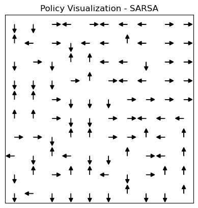
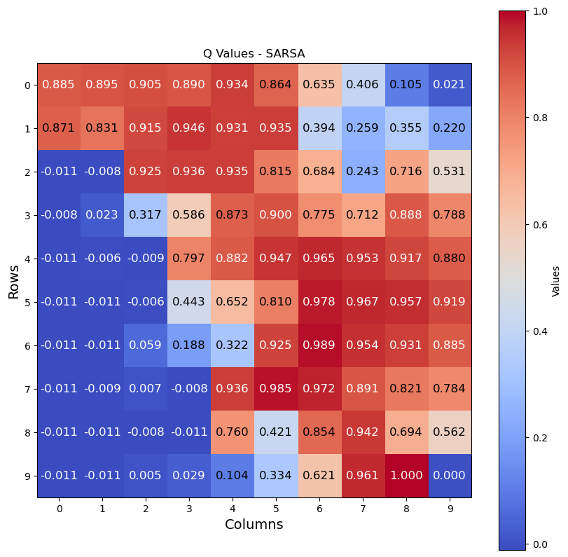
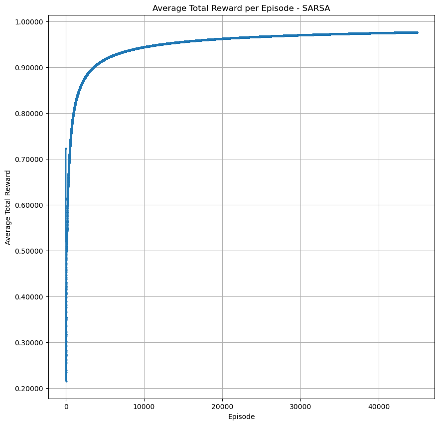
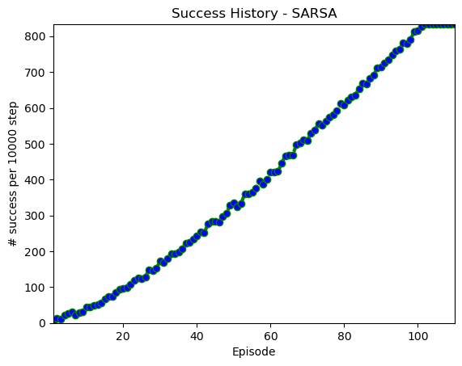
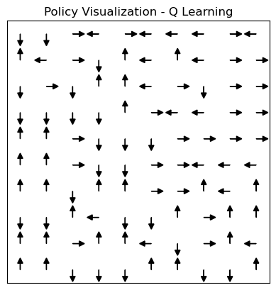
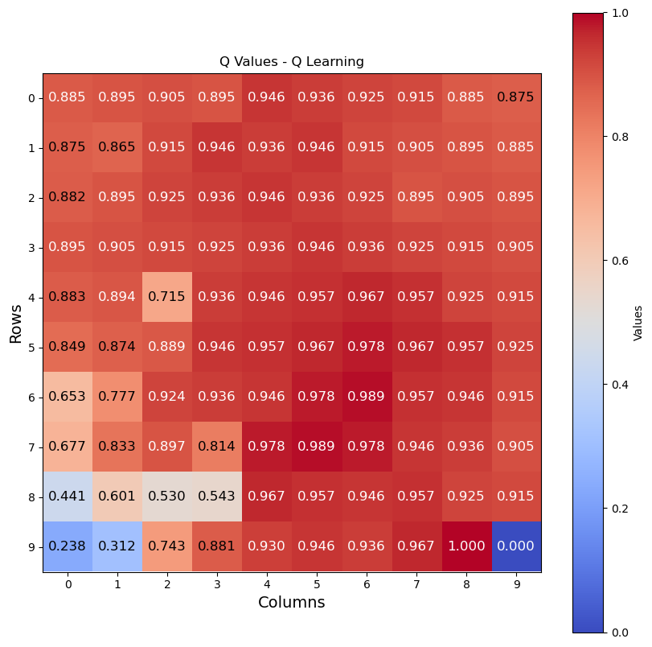
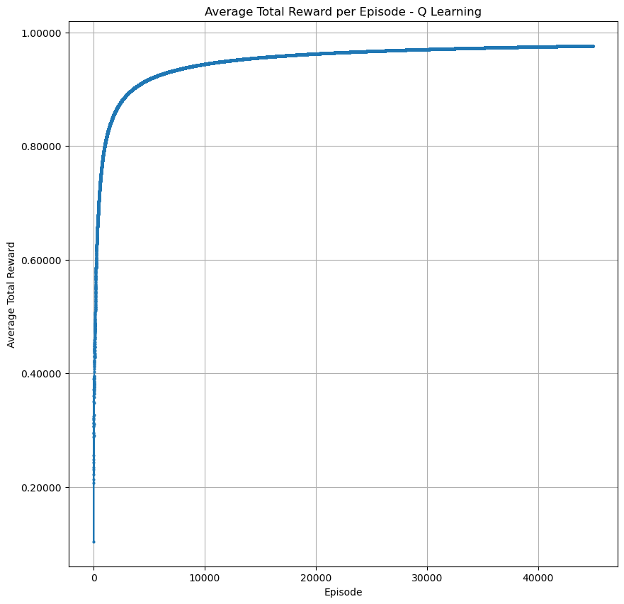

# Maze Reinforcement Learning with Q-Learning and SARSA

This repository contains an implementation of two classic reinforcement learning algorithms—**Q-Learning** and **SARSA**—applied to a maze environment using [gym-maze](https://github.com/MattChanTK/gym-maze). The implementation follows the formulations from *Artificial Intelligence: A Modern Approach (4th Edition)* by Peter Norvig and Stuart Russell.


*This is the agent being trained; learning the environment and the best actions gradually.*

## Overview

This project demonstrates how to apply **model-free reinforcement learning** techniques for solving maze navigation problems. The agent learns optimal actions through interaction with the environment and **trial-and-error learning**.

Key Features:
- Implements **Q-Learning** (off-policy) and **SARSA** (on-policy).
- Uses OpenAI Gym to simulate a **10x10 maze**.
- Provides visualizations for policy and Q-values.
- Tracks **training success rates and reward history**.

## Algorithms

### **Q-Learning (Off-Policy)**
Q-Learning updates Q-values using the **maximum possible future reward**, regardless of the agent's current policy. The update rule is:

$$
Q(s, a) \leftarrow Q(s, a) + \alpha \Big( r + \gamma \max_{a'} Q(s', a') - Q(s, a) \Big)
$$

where:
- $ s $ is the **current state**.
- $ a $ is the **current action**.
- $ r $ is the **reward** received.
- $ s' $ is the **next state**.
- $ \alpha $ is the **learning rate**.
- $ \gamma $ is the **discount factor**.
- $ \max_{a'} Q(s', a') $ is the **highest Q-value in the next state**.

Since **Q-Learning is off-policy**, it updates the Q-values using the best future reward estimate rather than following the current action-selection policy.

### **SARSA (On-Policy)**
The **SARSA** algorithm follows a policy-based update, meaning the next action is chosen **according to the agent’s current policy**:

$$
Q(s, a) \leftarrow Q(s, a) + \alpha \Big( r + \gamma Q(s', a') - Q(s, a) \Big)
$$

where:
- $ a' $ is the **next action** selected by the policy.

Since **SARSA is on-policy**, it learns the Q-values based on the actual action taken, rather than assuming the best possible action.

## Implementation Details

### **Environment Setup**
- The environment is based on `gym-maze`.
- The maze is a **10x10 grid** with discrete states.
- The **agent starts in a random position** and must find the goal.
- The **available actions** are:
  - `0`: North
  - `1`: East
  - `2`: South
  - `3`: West

### **Agent Class**
The `Agent` class implements both Q-Learning and SARSA. It includes:
- **Epsilon-Greedy Action Selection**
- **Q-Value Updates** based on the chosen algorithm.
- **Tracking of Success Rate and Total Rewards**.
- **Saving Policy and Q-value History** for analysis.

### **Visualization Functions**
- `draw_policy()`: Displays the learned policy as arrows in the maze.
- `draw_values()`: Plots Q-values as a heatmap.
- `plot_success_history()`: Graphs success rate over time.
- `plot_average_rewards()`: Shows average cumulative rewards per episode.

Below are sample outputs for both algorithms after training for 1 million steps.

**SARSA**

<table>
  <tr>
    <td align="center"></td>
    <td align="center"></td>
  </tr>
  <tr>
    <td align="center"></td>
    <td align="center"></td>
  </tr>
</table>

**Q Learning**

<table>
  <tr>
    <td align="center"></td>
    <td align="center"></td>
  </tr>
  <tr>
    <td align="center"></td>
    <td align="center"></td>
  </tr>
</table>


## **Installation**

Before running the code, install the `gym-maze` environment:

```bash
cd gym-maze
python setup.py install
```

Ensure the following dependencies are installed:

```bash
pip install gym numpy matplotlib pillow
```

## **Usage**

You're provided with a file named `maze.ipynb`. Open this file and run the cells one by one. To open the GUI and track the agent's progress, make sure to pass `render_gui=True` to the `Agent` class.

---

## Contributors

This project was developed as part of a group assignment for the Fundamentals of Artificial Intelligence course at the University of Isfahan, taught by Dr. Karshenas.


**Group Members:**  
- Zahra Masoumi (Github: [@asAlwaysZahra](https://github.com/asAlwaysZahra))
- Matin Azami (Github: [@InFluX-M](https://github.com/InFluX-M))
- Amirali Lotfi (Github: [@liAmirali](https://github.com/liAmirali/))


## **References**

- Norvig, P., & Russell, S. (2020). *Artificial Intelligence: A Modern Approach* (4th Edition). Pearson.
- OpenAI Gym: [https://gym.openai.com](https://gym.openai.com)
- Gym-Maze: [https://github.com/MattChanTK/gym-maze](https://github.com/MattChanTK/gym-maze)
